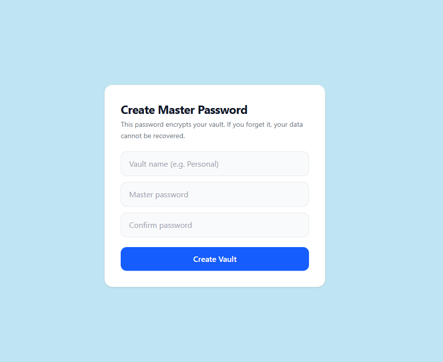
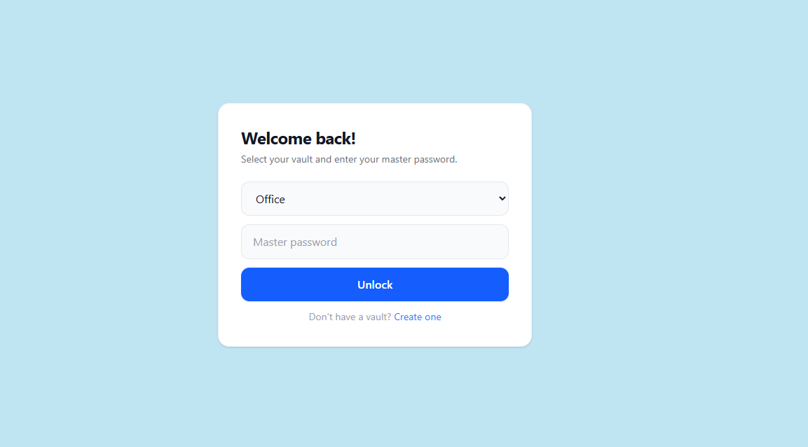
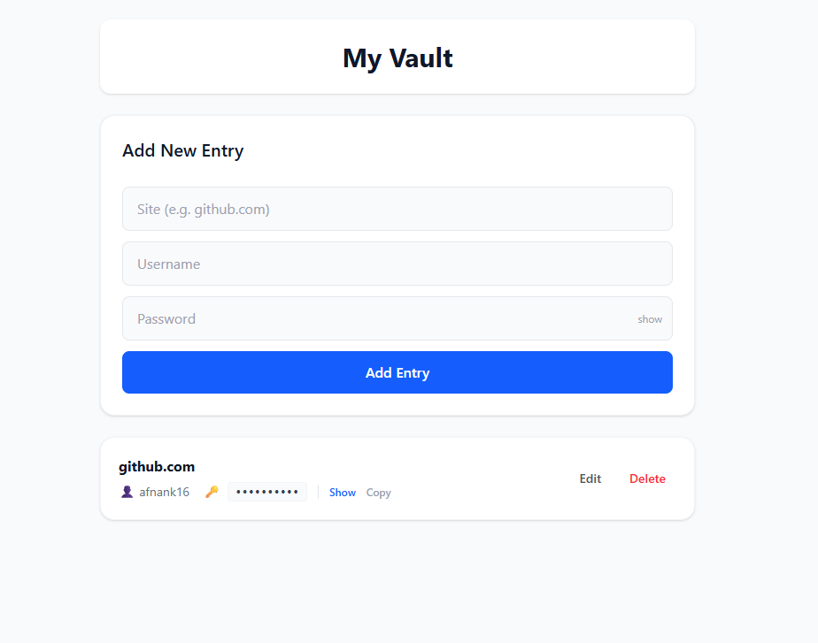

# VaultX — Password Manager

A secure, offline-first password manager built with React. All data is encrypted in the browser using the Web Crypto API — your passwords never leave your device.

---

## Features

- **Multi-vault support** — create separate vaults for personal, work, or any other use case
- **AES-GCM encryption** — industry-standard 256-bit encryption via the browser's native Web Crypto API
- **PBKDF2 key derivation** — master password is never stored; a cryptographic key is derived from it on every unlock
- **Master password verification** — wrong passwords are rejected before any data is accessed
- **Add, edit, delete entries** — full CRUD for saved passwords
- **Show/hide passwords** — toggle visibility per entry and while typing
- **Copy to clipboard** — one-click copy with visual confirmation
- **Search** — filter entries by site name instantly
- **Offline first** — everything runs locally in IndexedDB, no server required

---

## Tech Stack

| Layer | Technology |
|-------|-----------|
| UI | React + Tailwind CSS |
| Encryption | Web Crypto API (AES-GCM, PBKDF2) |
| Storage | IndexedDB via idb |
| Bundler | Vite |

---

## Security Model

- Master password is **never stored** anywhere
- A unique **salt** is generated per vault and stored in IndexedDB
- Salt + master password → **PBKDF2** (250,000 iterations, SHA-256) → AES-GCM CryptoKey
- Every entry is encrypted with a fresh **IV** on each save
- A **verify token** (known plaintext encrypted at setup) is used to validate the master password on unlock — wrong key = decryption failure = access denied
- The derived key lives in **React state only** — closing the tab locks the vault automatically

---

## Project Structure

```
src/
  components/
    MasterPasswordSetup.jsx   # First-time vault creation
    LockScreen.jsx            # Vault selector + unlock
    VaultList.jsx             # Main dashboard
  crypto/
    crypto.js                 # PBKDF2, AES-GCM encrypt/decrypt
  db/
    db.js                     # IndexedDB schema and operations
    vault.js                  # Bridge between crypto and storage
  App.jsx
  main.jsx
```

---

## Getting Started

```bash
# Install dependencies
npm install

# Start development server
npm run dev

# Build for production
npm run build
```

---

## How It Works

1. **First launch** — create a vault with a name and master password
2. **On return** — select your vault from the dropdown and enter your master password
3. **Inside the vault** — add entries with site, username, and password; edit or delete anytime
4. **Locking** — closing or refreshing the tab clears the key from memory, locking the vault

---

## Screenshots




## Limitations

- Master password **cannot be recovered** — if forgotten, vault data is permanently inaccessible
- Data is stored in the browser's IndexedDB — clearing browser data will delete all vaults
- Not synced across devices — this is a local-only solution by design

---

## License

MIT